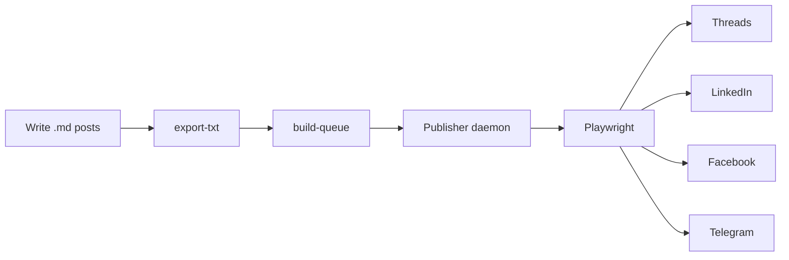

<h1 align="center">PostPilot</h1>
<p align="center">
  <strong>Open-source social media autoposter.</strong><br>
  Schedule and publish to Threads, LinkedIn, Facebook & Telegram from your terminal.
</p>

<p align="center">
  <a href="LICENSE"></a>
  
  
  
</p>

---

PostPilot treats social media posts as code. Write in Markdown, schedule with a queue, publish through a headless browser — no API rate limits, no monthly fees, full control.

## Why PostPilot?

|  | SaaS tools (Buffer, Later, Hootsuite) | PostPilot |
|---|---|---|
| **Cost** | $30–100/month | Free (self-hosted) |
| **Content storage** | Their database | Your git repo |
| **Workflow** | Point-and-click UI | Write Markdown, deploy, done |
| **Publishing** | Official API (character limits, restricted features) | Headless browser (full platform access) |
| **Version control** | None | Full git history, diffs, blame |
| **Content review** | Not possible | PR reviews on posts before they go live |
| **Customization** | Their feature roadmap | Your code, your rules |

## How It Works



1. **Write** posts as Markdown files, organized by date and time slot
2. **Export** Markdown to plain text (`export-txt`)
3. **Build** a publish queue with scheduled times (`build-queue`)
4. **Run** the publisher daemon — it polls the queue and publishes at the right time
5. **Publish** — Playwright opens a headless browser and posts exactly as you would manually

No API tokens needed for publishing. No character limits. No feature restrictions.

## Supported Platforms

| Platform | Backend | Status |
|---|---|---|
| Threads (Meta) | Playwright (headless Chromium) | Production |
| LinkedIn | Playwright (headless Chromium) | Production |
| Facebook | Playwright (headless Chromium) | Production |
| Telegram | Playwright (headless Chromium) | Production |

## Quick Start

### Prerequisites

- Python 3.11+
- Node.js 18+

### Install

```bash
git clone https://github.com/YOUR_USERNAME/postpilot.git
cd postpilot

npm install
npx playwright install chromium

cp .env.example .env
```

### Authenticate

Each platform needs a browser session. Log in once, and PostPilot saves the session:

```bash
# Threads
node scripts/threads_export_storage_state.mjs

# LinkedIn
node scripts/linkedin_export_storage_state.mjs

# Facebook
node scripts/facebook_export_storage_state.mjs
```

### Write Your First Post

```bash
mkdir -p content/threads/week-2025-01-06-to-2025-01-12/2025-01-06
```

Create `09-00.md` (publishes at 9:00 AM):

```markdown
Most startups don't fail because of bad code.
They fail because nobody can explain what the product does in one sentence.

Before your next sprint, ask 5 team members to describe your product.
If you get 5 different answers — that's your real bug.
```

### Publish

```bash
# Convert .md to .txt
python3 cli.py export-txt threads

# Build the publish queue
python3 cli.py build-queue threads \
  --content-root content/threads/week-2025-01-06-to-2025-01-12

# Start the publisher daemon
python3 cli.py run threads
```

The daemon runs continuously, publishing each post at its scheduled time slot.

## Content-as-Code

Posts are plain files in a date-based directory structure:

```
content/
└── threads/
    └── week-2025-01-06-to-2025-01-12/
        ├── 2025-01-06/
        │   ├── 09-00.md       ← source (you write this)
        │   ├── 09-00.txt      ← generated (this gets published)
        │   └── 12-00.md
        ├── 2025-01-07/
        │   └── ...
        └── README.md          ← optional week summary
```

- **Filename = time slot**: `09-00.md` publishes at 9:00 AM in your configured timezone
- **Directory = date**: posts are grouped by calendar day
- **Week folders**: batch content in weekly planning cycles
- **`.md` is source of truth**, `.txt` is what gets published

This gives you:

- `git diff` on content changes
- Pull request reviews on posts before they go live
- `git blame` to track who wrote what
- Rollback to any previous version
- Full audit trail of every edit

## AI Content Generation

PostPilot includes optional AI content generation via [OpenRouter](https://openrouter.ai/):

```bash
python3 scripts/threads_generate_daily.py
```

The generator:

- Analyzes your recent posts to avoid repetition
- Follows a content strategy framework (see [strategy/](strategy/))
- Rotates between content lanes (novelty, diagnosis, observation)
- Enforces quality guardrails (hook strength, character count, uniqueness check)
- Outputs `.md` files ready for review and publishing

Configure in `.env`:

```
OPENROUTER_API_KEY=your-key
OPENROUTER_MODEL=google/gemini-2.5-flash
```

## Deployment

PostPilot runs as a systemd service on any Linux VPS ($5/month is enough):

```bash
# Sync files to your server
rsync -avz --exclude='node_modules' --exclude='.git' \
  ./ your-server:/opt/postpilot/

# Install the systemd service
ssh your-server 'cd /opt/postpilot && sudo bash scripts/install_threads_publisher_service.sh'
```

### Reliability

- **Auto-restart** — systemd brings the service back on crash
- **Interrupted detection** — if the process dies mid-publish, the post is marked `interrupted`, not silently lost
- **Overdue protection** — posts past the max lag window are marked `missed` instead of dumped in a burst
- **Debug trail** — every action logged to JSONL with timestamps, IDs, and full context
- **Lock files** — prevents duplicate publisher instances

## Architecture

```
postpilot/
├── cli.py                              # Unified CLI entry point
├── scripts/
│   ├── threads_publisher.py            # Threads queue + scheduler + publisher
│   ├── threads_publish_playwright.mjs  # Playwright script for Threads
│   ├── threads_export_storage_state.mjs
│   ├── threads_generate_daily.py       # AI content generator
│   ├── linkedin_publisher.py           # LinkedIn publisher
│   ├── linkedin_publish_playwright.mjs
│   ├── facebook_publisher.py           # Facebook publisher
│   ├── facebook_publish_playwright.mjs
│   └── telegram_publisher.py           # Telegram publisher
├── content/                            # Your posts (Markdown + generated .txt)
├── state/                              # Queues, auth sessions, locks, debug logs
├── tests/                              # pytest test suite
└── strategy/                           # Content strategy framework (6 sections)
```

Each platform is fully independent — own publisher, own Playwright script, own state. No shared abstractions. If one platform breaks, the others keep running.

## CLI Reference

```bash
python3 cli.py <command> <platform> [args...]
```

| Command | Description |
|---|---|
| `run` | Start the publisher daemon |
| `build-queue` | Build publish queue from content directory |
| `export-txt` | Generate `.txt` from `.md` sources |
| `whoami` | Check authenticated identity (via official API) |
| `list-posts` | List published posts |
| `post-insights` | Get engagement metrics for a specific post |
| `user-insights` | Get account-level metrics |

## Configuration

All settings live in `.env`. See [`.env.example`](.env.example) for the full reference.

Key settings:

| Variable | Description | Default |
|---|---|---|
| `THREADS_TIMEZONE` | Your timezone for scheduling | `UTC` |
| `THREADS_PUBLISH_BACKEND` | `playwright` or `official` | `playwright` |
| `THREADS_PLAYWRIGHT_HEADLESS` | Run Chromium without a visible window | `true` |
| `THREADS_MAX_PUBLISH_LAG_SECONDS` | Seconds before overdue post is marked `missed` | `900` |
| `OPENROUTER_API_KEY` | API key for AI content generation | — |
| `OPENROUTER_MODEL` | Model for content generation | `google/gemini-2.5-flash` |

## Contributing

Contributions are welcome. The project follows three hard rules:

1. **TDD** — write the failing test first, then the implementation
2. **Logging** — every action must be logged (stdout for humans, JSONL for machines)
3. **Minimal code** — no abstractions for the future, no wrappers around simple operations

To contribute:

1. Fork the repository
2. Create a feature branch
3. Write tests for new functionality
4. Submit a pull request

## License

[MIT](LICENSE)
